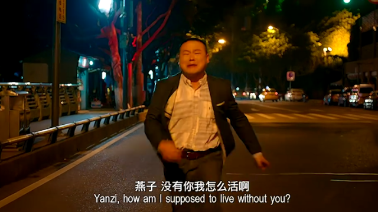

# PSA-Fusion:Cross-Modal Attention Fusion of Infrared and Visible Light Images using Pre-trained Siamese Networks

这里应该有一张模型结构图，但是我没画好

**这是一种新药，官方暂时命名为K2**

**If you want use this code and you can download dataset from here [Image Fusion Dataset](www.baidu.com).**

**Additionally,we have prepared the application in the directory named 'app'**

**After you configure the dataset directory,please run the train.py file**

