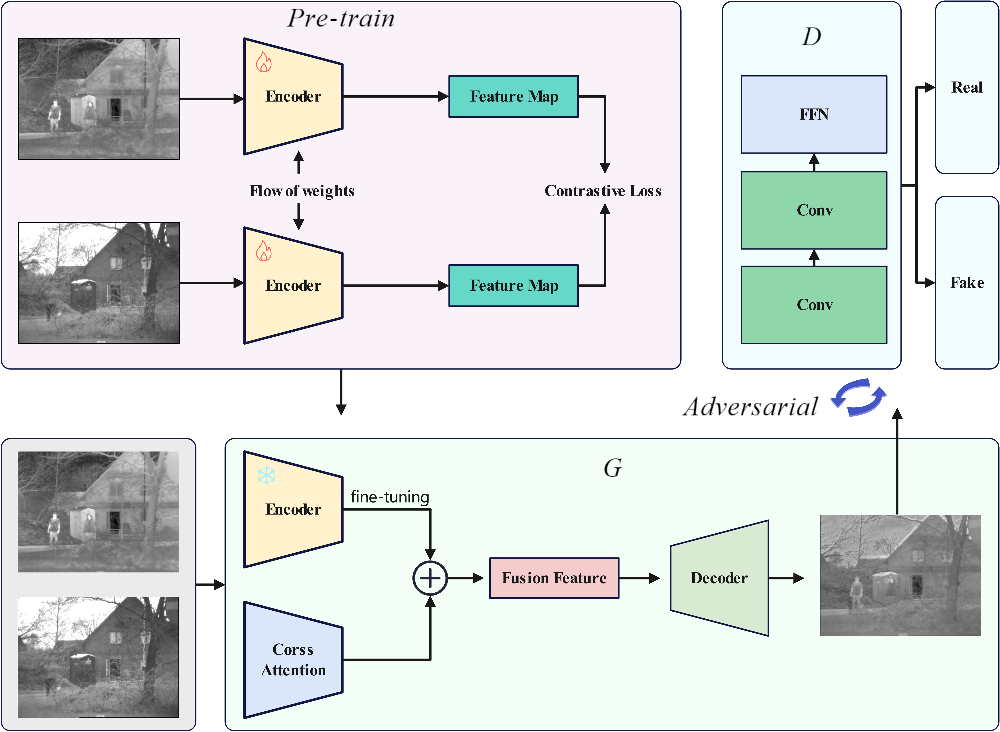
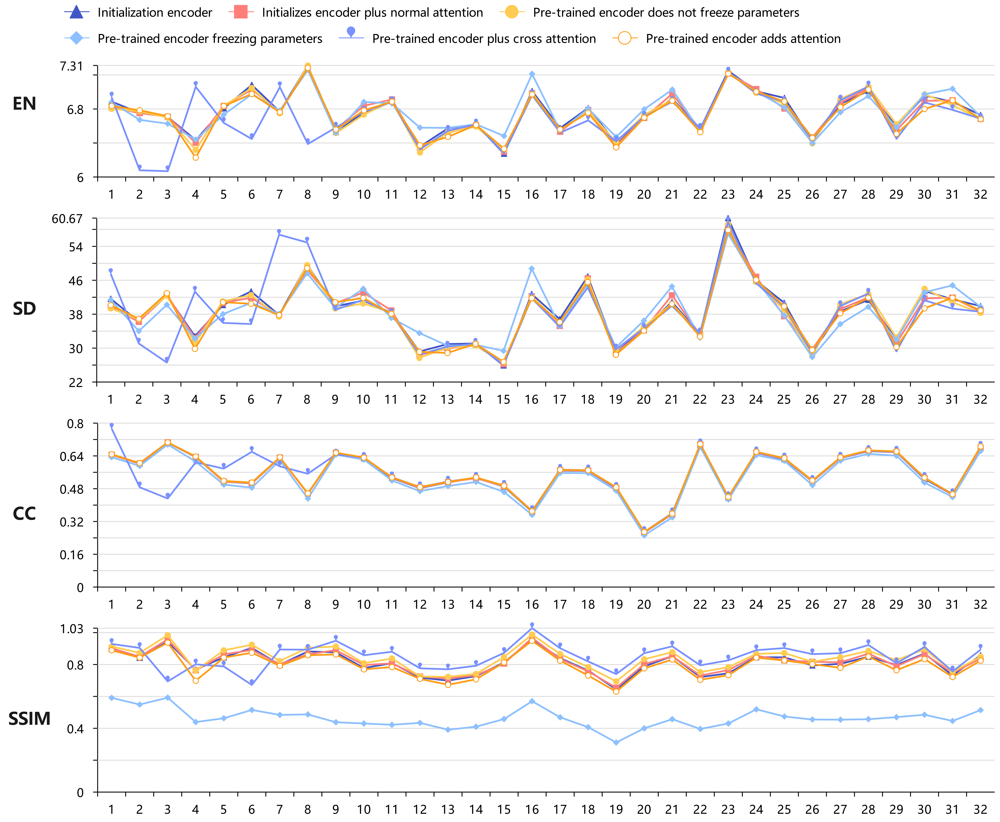

# PSA-Fusion:Cross-Modal Attention Fusion of Infrared and Visible Light Images using Pre-trained Siamese Networks


<hr/>


## model


<hr/>

## result




<hr/>

## Requirements

```bash

Python 3.6
matplotlib == 3.1.1
numpy == 1.19.4
pandas == 0.25.1
scikit_learn == 0.21.3
gradio==4.19.2
gradio_client==0.10.1
torch==1.13.1+cu117

```
<hr/>

**If you want use this code and you can download dataset from here [Image Fusion Dataset](https://github.com/Linfeng-Tang/MSRS).**

**Additionally,we have prepared the application in the directory named 'app'**

**After you configure the dataset directory,please run the train.py file**

